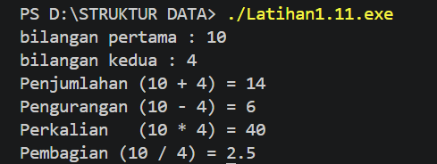
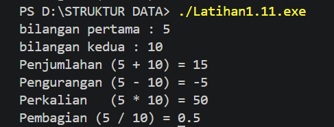
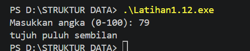
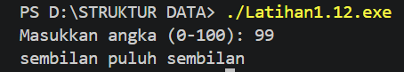
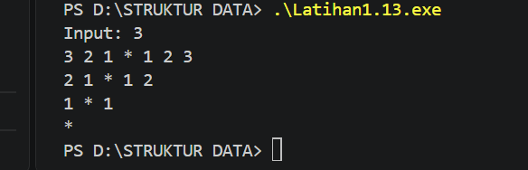
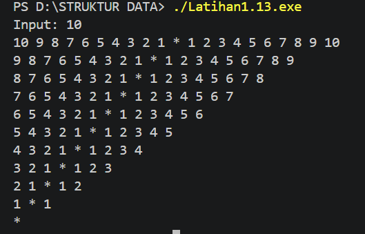

# <h1 align="center">Laporan Praktikum Modul 1 - Codeblocks IDE & Pengenalan Bahas C++ (Bagian Pertama)</h1>
<p align="center">Agung Tri Utomo - 109082500048</p>

## Dasar Teori
C++ merupakan bahasa pemrograman yang memiliki berbagai konsep dasar untuk membangun sebuah program, seperti variabel, tipe data, operator, percabangan, dan perulangan. Konsep-konsep tersebut merupakan bagian dari materi dasar pemrograman C++ dan digunakan untuk membantu programmer dalam mengolah data serta menyelesaikan suatu permasalahan.https://ejournal.undiksha.ac.id/index.php/JPTK/article/view/31?utm_source=chatgpt.com

## Unguided 

### 1. Buatlah program yang menerima input-an dua buah bilangan bertipe float, kemudian memberikan output-an hasil penjumlahan, pengurangan, perkalian, dan pembagian dari dua bilangan tersebut.

```C++
#include <iostream>
using namespace std;

int main() {
 float bil1, bil2;

 cout << "bilangan pertama : ";
 cin >> bil1;
 cout << "bilangan kedua : ";
 cin >> bil2;

 cout << "Penjumlahan (" << bil1 << " + " << bil2 << ") = " << bil1 + bil2 << endl;
 cout << "Pengurangan (" << bil1 << " - " << bil2 << ") = " << bil1 - bil2 << endl;
 cout << "Perkalian   (" << bil1 << " * " << bil2 << ") = " << bil1 * bil2 << endl;
 cout << "Pembagian (" << bil1 << " / " << bil2 << ") = " << bil1 / bil2 << endl;
 return 0;
}
```
### Output Unguided 1.1 :
Bilangan pertama : 10 Bilangan kedua : 4
penjumlahan (10+4)= 14
Pengurangan (10-4)= 6
perkalian (10*4)= 40
pembagian (10/4)= 2.5

##### Output 1.1


### Output Unguided 1.2 :
Bilangan pertama : 5 Bilangan kedua : 10
penjumlahan (5+10)= 15
pengurangan (5-10)= -5
perkalian (5*10)= 50
pembagian (5/10)= 0.5

##### Output 1.2


Program ini bertujuan untuk membuat kalkulator aritmatika dasar yang menerima input dua bilangan bertipe float. Nilai yang dimasukkan pengguna disimpan ke dalam variabel bil1 dan bil2, kemudian program langsung menghitung serta menampilkan hasil penjumlahan, pengurangan, perkalian, dan pembagian.

### 2. Buatlah sebuah program yang menerima masukan angka dan mengeluarkan output nilai angka tersebut dalam bentuk tulisan. Angka yang akan di-input-kan user adalah bilangan bulat positif mulai dari 0 s.d 100.

```C++
#include <iostream>
using namespace std;

int main() {
    int angka;

    string satuan[] = {
        "nol", "satu", "dua", "tiga", "empat",
        "lima", "enam", "tujuh", "delapan", "sembilan",
        "sepuluh", "sebelas"
    };

    cout << "Masukkan angka (0-100): ";
    cin >> angka;

    if (angka >= 0 && angka <= 11) {
        cout << satuan[angka];
    }
    else if (angka < 20) {
        cout << satuan[angka - 10] << " belas";
    }
    else if (angka < 100) {
        int puluh = angka / 10;
        int sisa = angka % 10;

        cout << satuan[puluh] << " puluh";

        if (sisa != 0)
            cout << " " << satuan[sisa];
    }
    else if (angka == 100) {
        cout << "seratus";
    }
    else {
        cout << "Angka harus antara 0 - 100";
    }

```
### Output Unguided 2.1 :
79 : tujuh puluh sembilan
##### Output 2.1


### Output Unguided 2.2 :
99 : sembilan puluh sembilan
##### Output 2.2


Program ini memproses input angka dan mencetak sebutan atau ejaannya secara langsung. Array satuan menyimpan kata dasar untuk angka 0 sampai 11. Kondisi if-else digunakan untuk menentukan apakah angka tersebut masuk kelompok satuan/belasan (di bawah 20), puluhan (di bawah 100), atau angka 100.

### 3. Buatlah program yang dapat memberikan input dan output sbb
** Input: 3
Output: 3 2 1 * 1 2 3 2 1 * 1 2 1 * 1 ***

```C++
#include <iostream>
using namespace std;

int main() {
    int n;

    cout << "Input: ";
    cin >> n;

    for (int i = n; i >= 0; i--) {

        for (int j = i; j >= 1; j--) {
            cout << j << " ";
        }

        cout << "*";

        for (int j = 1; j <= i; j++) {
            cout << " " << j;
        }

        cout << endl;
    }

    return 0;
}
```
### Output Unguided 3.1 :
input : 3
output : 321*123 21*12 1*1 *

##### Output 3.1


### Output Unguided 3.2 :
input : 10
output : 10 9 8 7 6 5 4 3 2 1 * 1 2 3 4 5 6 7 8 9 10
9 8 7 6 5 4 3 2 1 * 1 2 3 4 5 6 7 8 9
8 7 6 5 4 3 2 1 * 1 2 3 4 5 6 7 8
7 6 5 4 3 2 1 * 1 2 3 4 5 6 7
6 5 4 3 2 1 * 1 2 3 4 5 6
5 4 3 2 1 * 1 2 3 4 5
4 3 2 1 * 1 2 3 4
3 2 1 * 1 2 3
2 1 * 1 2
1 * 1
*
##### Output 3.2


Program ini mencetak pola angka bertingkat berdasarkan nilai n yang dimasukkan. Menggunakan perulangan for, program mencetak spasi untuk menggeser posisi, diikuti deret angka menurun, tanda bintang di bagian tengah, dan deret angka menaik. Pada bagian paling akhir, program mencetak satu tanda bintang tunggal di posisi tengah sebagai penutup pola.

## Kesimpulan
Praktikum ini memberikan saya pengalaman dalam memahami dan menerapkan dasar-dasar pemrograman menggunakan bahasa C++. Melalui tugas unguided pada Modul 1, saya belajar bagaimana menggunakan variabel dan beberapa tipe data seperti int, float, dan string sesuai dengan kebutuhan program. Selain itu, saya juga memahami penggunaan operator matematika untuk melakukan berbagai perhitungan. Dalam pengerjaan tugas, saya menerapkan percabangan if-else untuk menentukan kondisi tertentu serta menggunakan perulangan bersarang (nested loop) untuk menghasilkan proses yang dilakukan secara berulang. Dari praktikum ini, saya menjadi lebih memahami bagaimana konsep-konsep dasar tersebut dapat digunakan secara bersama-sama untuk membuat dan menyelesaikan sebuah program C++.

## Referensi
[1] Triase. (2020). Diktat Edisi Revisi : STRUKTUR DATA. Medan: UNIVERSTAS ISLAM NEGERI SUMATERA UTARA MEDAN. 
<br>[2] Indahyati, Uce., Rahmawati Yunianita. (2020). "BUKU AJAR ALGORITMA DAN PEMROGRAMAN DALAM BAHASA C++". Sidoarjo: Umsida Press. Diakses pada 10 Maret 2024 melalui https://doi.org/10.21070/2020/978-623-6833-67-4.
<br> [3] Painem, Soetanto, H., Kristanto, D., Solichin, A., & Rusdah. (2023). Peningkatan kompetensi algoritma dan pemrograman C/C++ bagi siswa dan siswi SMK YADIKA 4. KACANEGARA Jurnal Pengabdian pada Masyarakat, 6(4). https://ejournals.itda.ac.id/index.php/KACANEGARA/article/view/1689

