# <h1 align="center">Laporan Praktikum Modul 2 - Codeblocks IDE & Pengenalan Bahas C++ (Bagian Pertama)</h1>
<p align="center"> Agung Tri Utomo / 109082500048</p>

## Dasar Teori
Struktur data dalam C++ digunakan untuk mengatur dan mengolah data secara terstruktur. Praktikum ini menggunakan array, matriks, pointer, reference, function, dan switch-case untuk menyimpan data, mengolah nilai, serta membuat program dengan pilihan menu. Konsep tersebut membantu membuat program lebih terstruktur dan mudah digunakan.Logožar, R., Mikac, M., & Radošević, D. (2024). Exploring the Access to the Static Array Elements via Indices and via Pointers — the Introductory C++ Case Expanded. Journal of Information and Organizational Sciences, 48(1), 49–80.https://doi.org/10.31341/jios.48.1.3

### A. Guided<br/>
Berisi kegiatan guided dan penjelasan singkat mengenai program yang dibuat.
#### 1. Guided 1 – Matriks 3×3
Membuat program untuk memasukkan dan menampilkan matriks 3×3 menggunakan array dua dimensi.
#### 2. Guided 2 – Pointer dan Reference
Membuat program untuk memahami penggunaan pointer dan reference dalam mengubah nilai variabel.
#### 3. Guided 3 – Function dan Array
Membuat program menggunakan function untuk mencari nilai maksimum dari array.

### B.Latihan <br/>
Berisi hasil pengerjaan latihan Modul 2.
#### 1. Operasi Matriks 3×3
Program penjumlahan, pengurangan, dan perkalian matriks.
#### 2. Pointer dan Reference
Program menukar nilai dari 3 variabel menggunakan pointer dan reference.
#### 3. Array dan Function
Program mencari nilai minimum, maksimum, dan rata-rata menggunakan function serta menu switch-case.

## Guided 

### 1. Matriks 3×3

```C++
#include <iostream>
using namespace std;

int main() {
    int A[3][3];

    cout << "Masukkan matriks 3x3:\n";
    for (int i = 0; i < 3; i++)
        for (int j = 0; j < 3; j++)
            cin >> A[i][j];

    cout << "Matriks:\n";
    for (int i = 0; i < 3; i++) {
        for (int j = 0; j < 3; j++)
            cout << A[i][j] << " ";
        cout << endl;
    }

    return 0;
}
```
Program ini menggunakan array 2 dimensi untuk menyimpan 9 nilai dalam bentuk matriks 3×3. Perulangan for digunakan untuk memasukkan dan menampilkan setiap elemen matriks

### 2. Pointer dan Reference

```C++ Pointer
#include <iostream>
using namespace std;

void pointer(int *a) {
    *a = 20;
}

void reference(int &b) {
    b = 30;
}

int main() {
    int a = 10, b = 10;

    pointer(&a);
    reference(b);

    cout << "Pointer = " << a << endl;
    cout << "Reference = " << b << endl;

    return 0;
}
```
Program ini menunjukkan penggunaan pointer dan reference untuk mengubah nilai variabel. Pointer menggunakan alamat variabel dengan & dan mengakses nilainya dengan *, sedangkan reference menjadi nama lain dari variabel.

### 3. Function dan Array

```C++
#include <iostream>
using namespace std;

int cariMaksimum(int arr[], int n) {
    int max = arr[0];

    for (int i = 1; i < n; i++)
        if (arr[i] > max)
            max = arr[i];

    return max;
}

int main() {
    int arr[5] = {10, 25, 7, 40, 15};

    cout << "Nilai maksimum = "
         << cariMaksimum(arr, 5);

    return 0;
}
```
Program ini menggunakan function cariMaksimum() untuk mencari nilai terbesar dari sebuah array. Perulangan digunakan untuk membandingkan setiap nilai dalam array.

## Unguided 

### 1. Buatlah program yang dapat melakukan operasi penjumlahan, pengurangan, dan perkalian matriks 3x3 

```C++
#include <iostream>
using namespace std;

int main() {
    int A[3][3], B[3][3];
    int tambah[3][3], kurang[3][3], kali[3][3];

    cout << "Masukkan Matriks A (3x3):\n";
    for (int i = 0; i < 3; i++) {
        for (int j = 0; j < 3; j++) {
            cin >> A[i][j];
        }
    }

    cout << "\nMasukkan Matriks B (3x3):\n";
    for (int i = 0; i < 3; i++) {
        for (int j = 0; j < 3; j++) {
            cin >> B[i][j];
        }
    }

    // Penjumlahan dan pengurangan
    for (int i = 0; i < 3; i++) {
        for (int j = 0; j < 3; j++) {
            tambah[i][j] = A[i][j] + B[i][j];
            kurang[i][j] = A[i][j] - B[i][j];
        }
    }

    // Perkalian
    for (int i = 0; i < 3; i++) {
        for (int j = 0; j < 3; j++) {
            kali[i][j] = 0;
            for (int k = 0; k < 3; k++) {
                kali[i][j] += A[i][k] * B[k][j];
            }
        }
    }

    cout << "\nHasil Penjumlahan:\n";
    for (int i = 0; i < 3; i++) {
        for (int j = 0; j < 3; j++)
            cout << tambah[i][j] << " ";
        cout << endl;
    }

    cout << "\nHasil Pengurangan:\n";
    for (int i = 0; i < 3; i++) {
        for (int j = 0; j < 3; j++)
            cout << kurang[i][j] << " ";
        cout << endl;
    }

    cout << "\nHasil Perkalian:\n";
    for (int i = 0; i < 3; i++) {
        for (int j = 0; j < 3; j++)
            cout << kali[i][j] << " ";
        cout << endl;
    }

    return 0;
}
```
### Output Unguided 1 :

##### Output 1
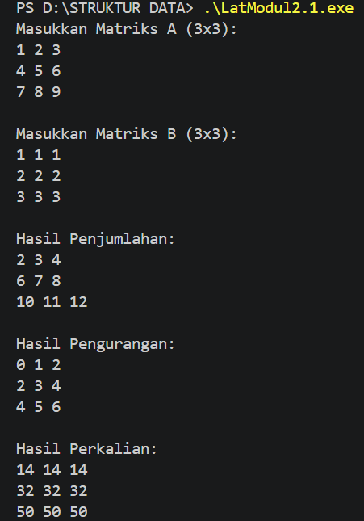

##### Output 2
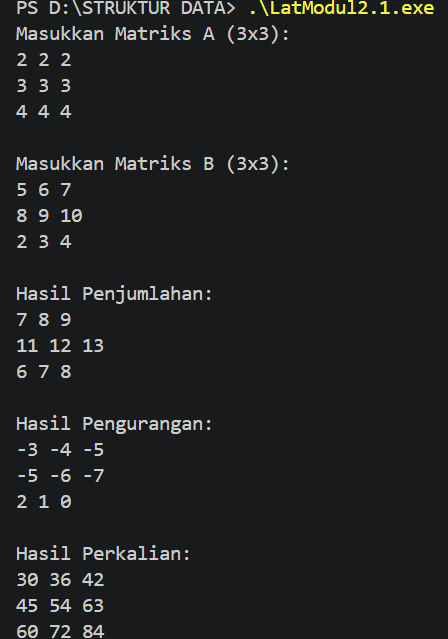

Program ini digunakan untuk melakukan operasi penjumlahan, pengurangan, dan perkalian pada dua matriks berukuran 3×3 menggunakan array dua dimensi.

### 2. Berdasarkan guided pointer dan reference sebelumnya, buatlah keduanya dapat menukar nilai dari 3 variabel 

```C++ Pointer 
#include <iostream>
using namespace std;

void tukarPointer(int *a, int *b, int *c) {
    int temp = *a;
    *a = *b;
    *b = *c;
    *c = temp;
}

int main() {
    int a, b, c;

    cout << "Masukkan nilai a: ";
    cin >> a;

    cout << "Masukkan nilai b: ";
    cin >> b;

    cout << "Masukkan nilai c: ";
    cin >> c;

    cout << "\nSebelum ditukar: ";
    cout << a << " " << b << " " << c << endl;

    tukarPointer(&a, &b, &c);

    cout << "Setelah ditukar: ";
    cout << a << " " << b << " " << c << endl;

    return 0;
}

```C++ Reference
#include <iostream>
using namespace std;

void tukarReference(int &a, int &b, int &c) {
    int temp = a;
    a = b;
    b = c;
    c = temp;
}

int main() {
    int a, b, c;

    cout << "Masukkan nilai a: ";
    cin >> a;

    cout << "Masukkan nilai b: ";
    cin >> b;

    cout << "Masukkan nilai c: ";
    cin >> c;

    cout << "\nSebelum ditukar: ";
    cout << a << " " << b << " " << c << endl;

    tukarReference(a, b, c);

    cout << "Setelah ditukar: ";
    cout << a << " " << b << " " << c << endl;

    return 0;
}
```
### Output Unguided 2 :

##### Output 1 Pointer
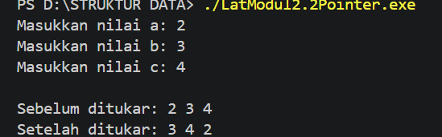

##### Output 2 reference
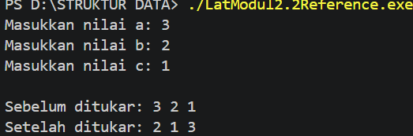

Program ini menggunakan pointer dan reference untuk menukar nilai dari tiga variabel. Pointer menggunakan alamat memori, sedangkan reference digunakan sebagai alias dari variabel.

### 3. Diketahui sebuah array 1 dimensi sebagai berikut :  arrA = {11, 8, 5, 7, 12, 26, 3, 54, 33, 55} Buatlah program yang dapat mencari nilai minimum, maksimum, dan rata – rata dari array tersebut! Gunakan function cariMinimum() untuk mencari nilai minimum dan function cariMaksimum() untuk mencari nilai maksimum, serta gunakan prosedur hitungRataRata() untuk menghitung nilai rata – rata! Buat program menggunakan menu switch-case seperti berikut ini : --- Menu Program Array --- 1. Tampilkan isi array 2. cari nilai maksimum 3. cari nilai minimum 4. Hitung nilai rata - rata 

```C++
#include <iostream>
using namespace std;

int cariMinimum(int arr[], int n) {
    int min = arr[0];

    for (int i = 1; i < n; i++) {
        if (arr[i] < min) {
            min = arr[i];
        }
    }

    return min;
}

int cariMaksimum(int arr[], int n) {
    int max = arr[0];

    for (int i = 1; i < n; i++) {
        if (arr[i] > max) {
            max = arr[i];
        }
    }

    return max;
}

void hitungRataRata(int arr[], int n) {
    int jumlah = 0;

    for (int i = 0; i < n; i++) {
        jumlah += arr[i];
    }

    float rata = (float) jumlah / n;

    cout << "Nilai rata-rata = " << rata << endl;
}

int main() {
    int arrA[] = {11, 8, 5, 7, 12, 26, 3, 54, 33, 55};
    int n = 10;
    int pilihan;

    do {
        cout << "\n--- Menu Program Array ---\n";
        cout << "1. Tampilkan isi array\n";
        cout << "2. Cari nilai maksimum\n";
        cout << "3. Cari nilai minimum\n";
        cout << "4. Hitung nilai rata-rata\n";
        cout << "5. Keluar\n";
        cout << "Pilih menu: ";
        cin >> pilihan;

        switch (pilihan) {
            case 1:
                cout << "\nIsi array: ";
                for (int i = 0; i < n; i++) {
                    cout << arrA[i] << " ";
                }
                cout << endl;
                break;

            case 2:
                cout << "\nNilai maksimum = "
                     << cariMaksimum(arrA, n) << endl;
                break;

            case 3:
                cout << "\nNilai minimum = "
                     << cariMinimum(arrA, n) << endl;
                break;

            case 4:
                cout << endl;
                hitungRataRata(arrA, n);
                break;

            case 5:
                cout << "\nProgram selesai." << endl;
                break;

            default:
                cout << "\nPilihan tidak tersedia." << endl;
        }

    } while (pilihan != 5);

    return 0;
}
```
### Output Unguided 3 :

##### Output 1
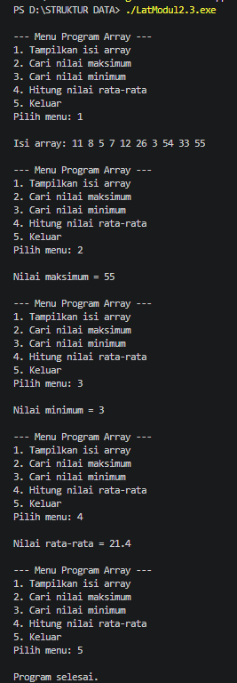

Program ini menggunakan array yang berisi 10 nilai untuk mencari nilai maksimum, minimum, dan rata-rata. Program dilengkapi menu switch-case serta function cariMinimum(), cariMaksimum(), dan hitungRataRata().

### Tamabahan Praktikum

## 1. Code Array1

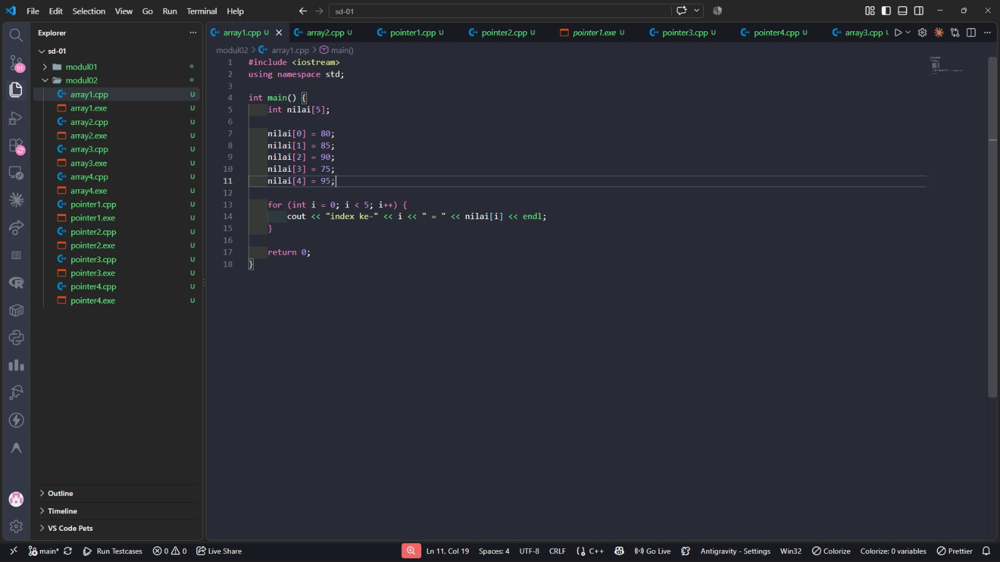

### Output Array1

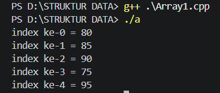

### Penjelasan
Output menampilkan lima nilai yang telah dimasukkan ke dalam array satu dimensi. Setelah itu, program menampilkan isi array nilai_tahun yang terdiri dari 5 baris dan 5 kolom. Nilai pada array dua dimensi ditampilkan berurutan dari baris pertama sampai baris terakhir.

---

## 2. Code Array2

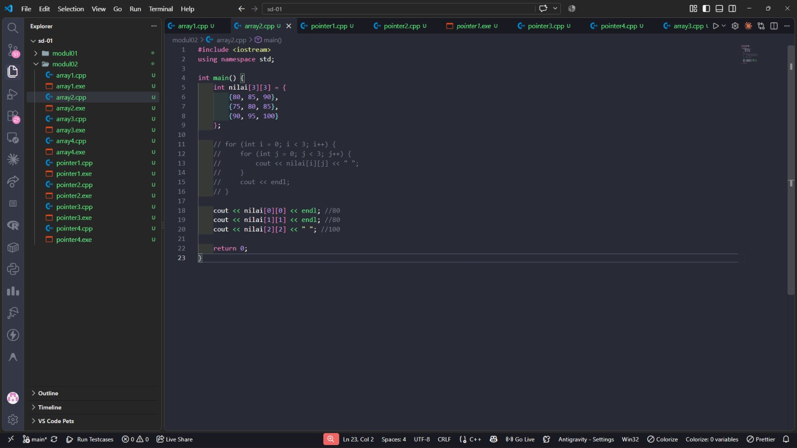

### Output Array2

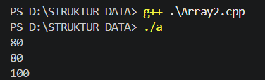

### Penjelasan


---

## 3. Code Array3

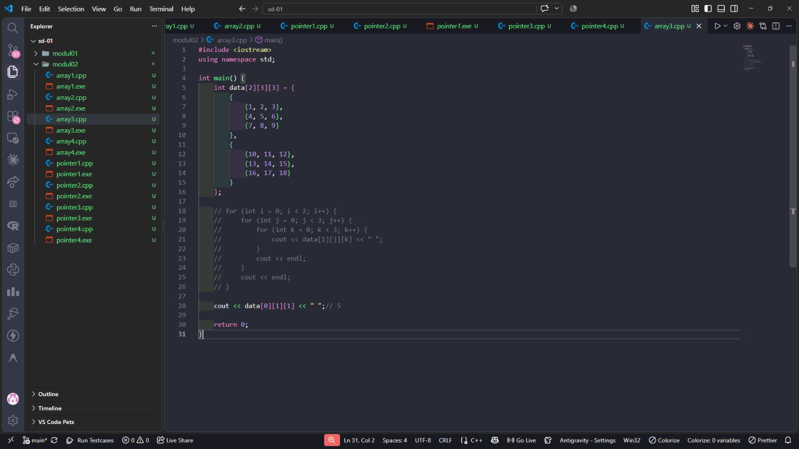

### Output Array3

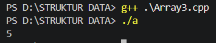

### Penjelasan


---

## 4. Code Array4

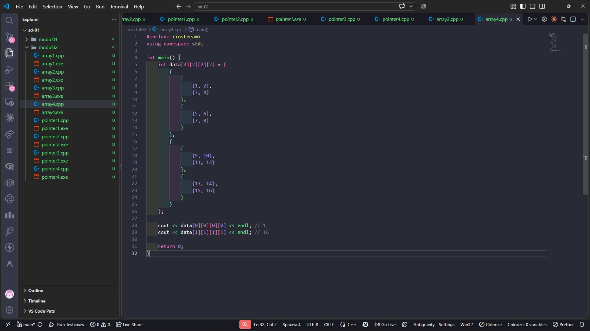

### Output Array4

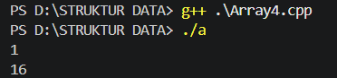

### Penjelasan


## 1. Code Pointer1

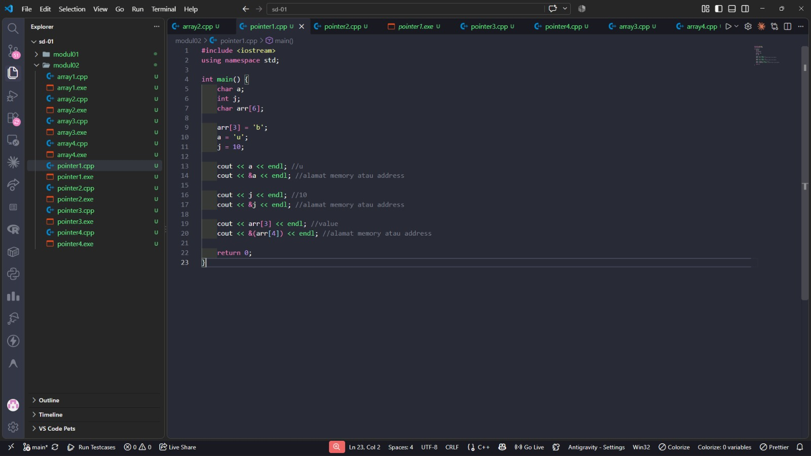

### Output Pointer1

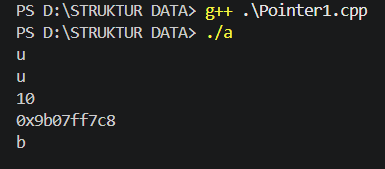

### Penjelasan


---

## 2. Code Pointer2

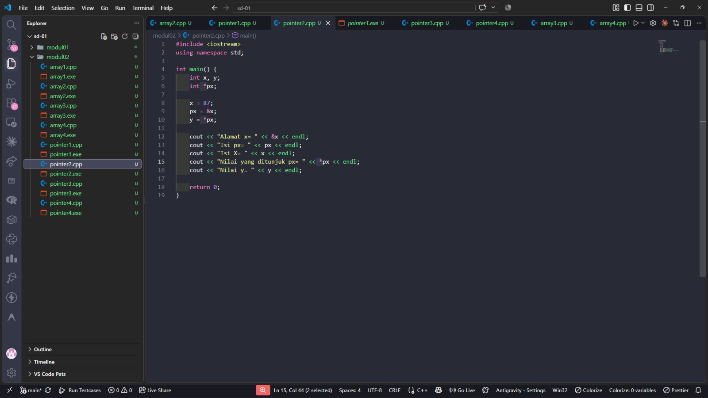

### Output Pointer2

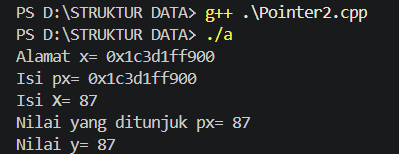

### Penjelasan


---

## 3. Code Pointer3

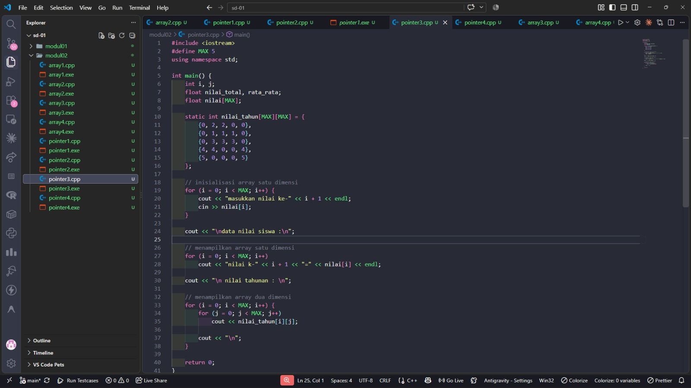

### Output Pointer3

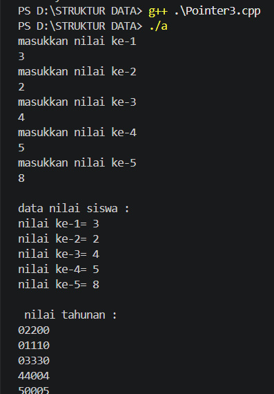

### Penjelasan


---

## 4. Code Pointer4

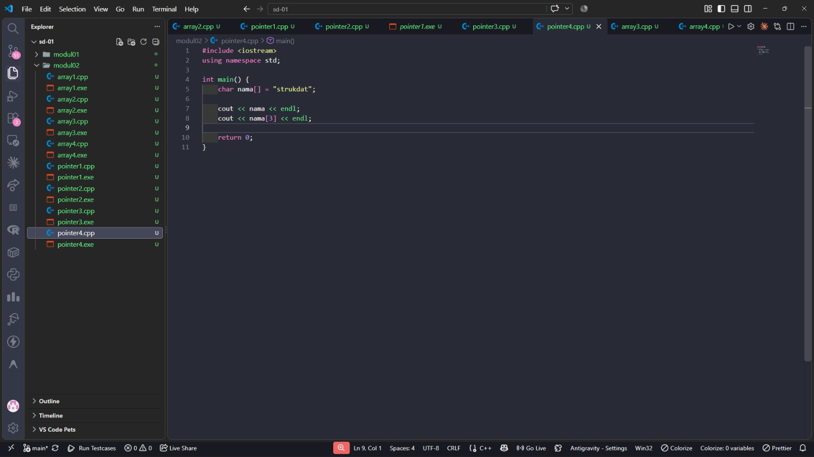

### Output Pointer4

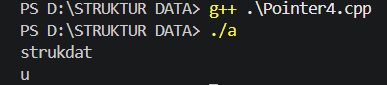

### Penjelasan


## Kesimpulan
Praktikum ini memberikan pemahaman mengenai penggunaan array, matriks, pointer, reference, function, dan switch-case dalam C++. Konsep tersebut dapat diterapkan untuk melakukan operasi matriks, menukar nilai tiga variabel, serta mencari nilai minimum, maksimum, dan rata-rata pada array. Praktikum ini juga membantu meningkatkan pemahaman mengenai dasar struktur data dan pemrograman C++.

## Referensi
[1] Triase. (2020). Diktat Edisi Revisi : STRUKTUR DATA. Medan: UNIVERSTAS ISLAM NEGERI SUMATERA UTARA MEDAN. 
<br>[2] Indahyati, Uce., Rahmawati Yunianita. (2020). "BUKU AJAR ALGORITMA DAN PEMROGRAMAN DALAM BAHASA C++". Sidoarjo: Umsida Press. Diakses pada 10 Maret 2024 melalui https://doi.org/10.21070/2020/978-623-6833-67-4.
<br>[3] Logožar, R., Mikac, M., & Radošević, D. (2024).
Exploring the Access to the Static Array Elements via Indices and via Pointers — the Introductory C++ Case Expanded. Journal of Information and Organizational Sciences, 48(1), 49–80.
DOI: 10.31341/jios.48.1.3.https://oaji.net/articles/2023/7988-1720695924.pdf?utm_source=chatgpt.com
<br> [4] Huang, G. (2011).
The Rank and Relation on C++ Array and Pointer. 2011 International Conference on Information Technology and Artificial Intelligence (ITAIC).https://doi.org/10.1109/ITAIC.2011.6030273?utm_source=chatgpt.com
